<h1>Site com Flexbox com barra de navegação fixa.</h1>

## Funcionalidades do Site
### Este site foi desenvolvido para oferecer uma experiência de compra online personalizada e acessível. Ele possui as seguintes funcionalidades:

### Ajuste de Tamanho de Fonte: O usuário pode personalizar a experiência de leitura, ajustando o tamanho da fonte de acordo com suas preferências. Há opções para aumentar e diminuir o tamanho da letra, garantindo que todos possam navegar e consumir o conteúdo do site de forma confortável.

### Escolha do Tamanho da Roupa: Durante a navegação, o usuário pode selecionar o tamanho das roupas que deseja comprar. Isso é feito de forma intuitiva, facilitando a escolha do tamanho ideal antes de adicionar os itens ao carrinho de compras.

### Carrinho de Compras: O site possui um carrinho de compras onde o usuário pode adicionar, revisar e remover produtos antes de finalizar a compra. Se o usuário decidir remover algum item do carrinho, isso pode ser feito com facilidade, garantindo flexibilidade durante o processo de compra.

### Pagamento com Cartão: Para finalizar a compra, o usuário pode optar por pagar utilizando cartão de crédito. O processo de pagamento é seguro e eficiente, garantindo uma transação tranquila e confiável.

## 4 páginas html:
- index.html
- produtos.html.
- fale-conosco.html
- perfil.html
- cadastro.html
- carrinho.html

## 1 pasta css:
- cadastro.css
- carrinho.css
- fale-conosco.css
- increase-decrease.css
- login.css
- produtos.css
- styles.css

## 1 pasta JS:
- carrinho.js
- fale-conosco.js
- increase-decrease.js
- login.js
- produtos.js
- script.js

 

 <h2>Index</h2>
 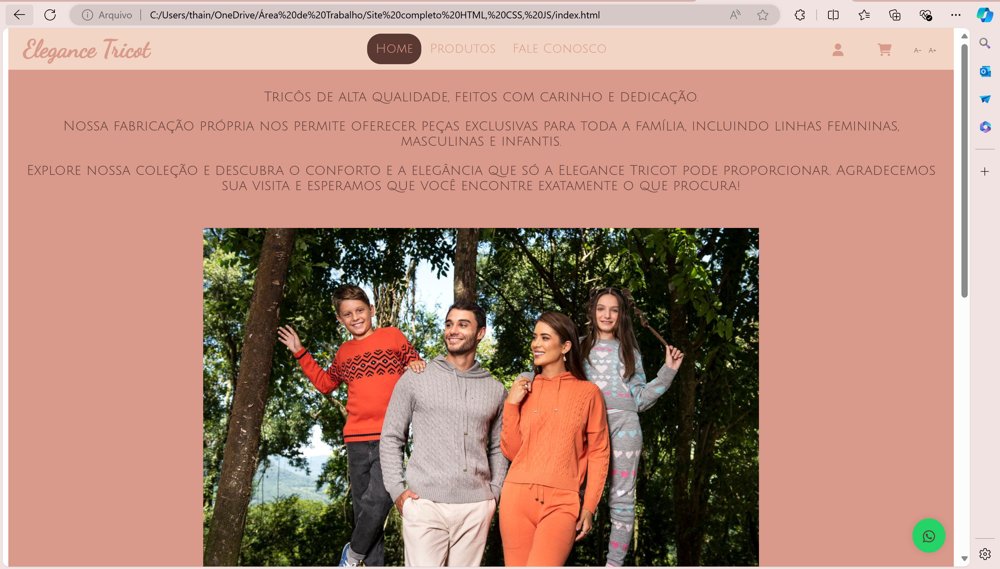
 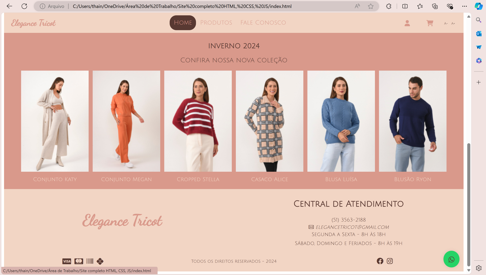
  

  <h2>Produtos</h2>
  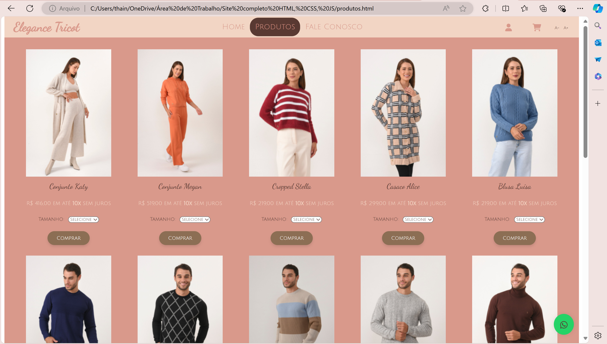
  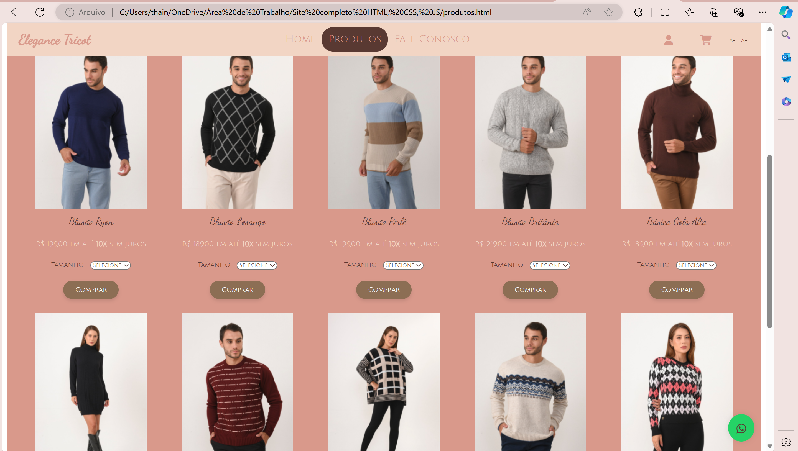
  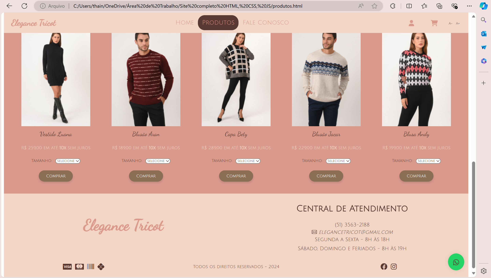
   

  <h2>Fale Conosco</h2>
  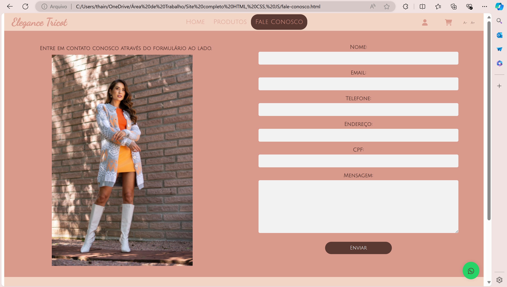
  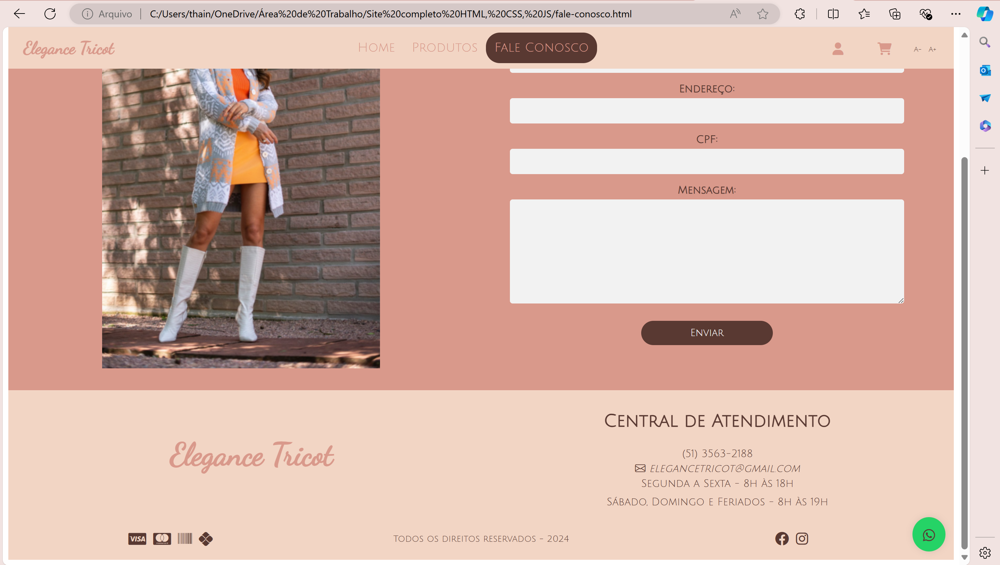 
   

  <h2>Perfil</h2>
  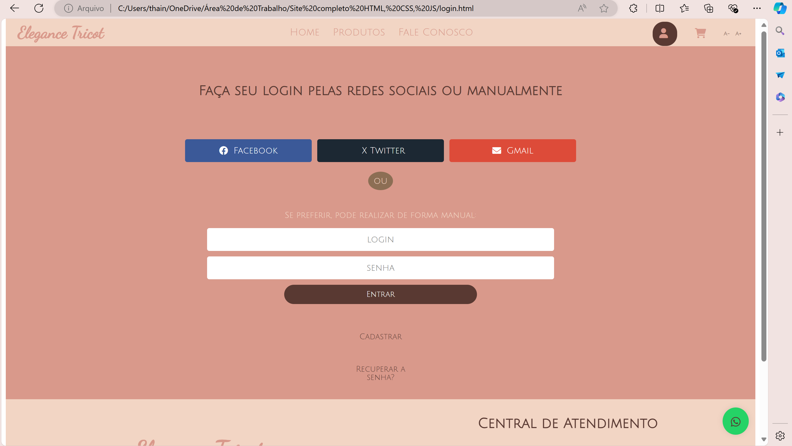
  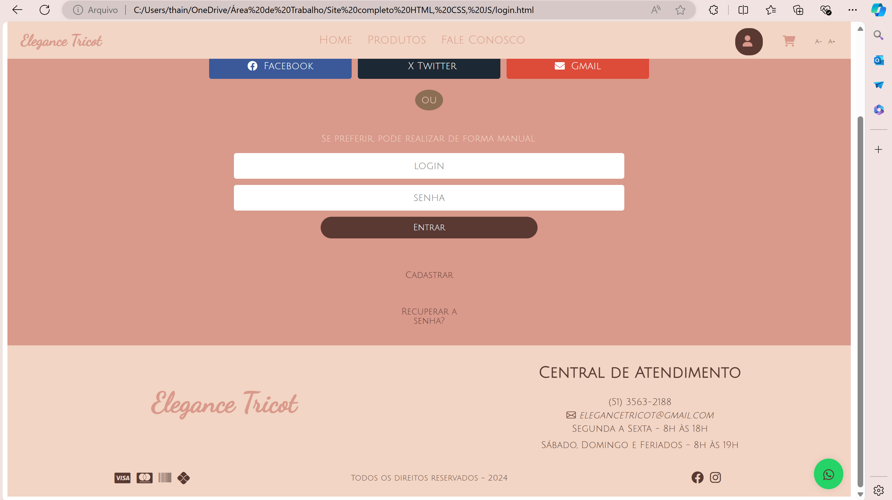
   

  <h2>Cadastro</h2>
  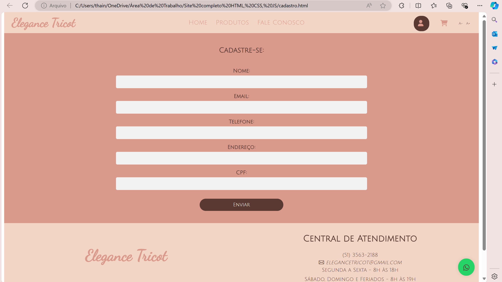
   

  <h2>Carrinho</h2>
  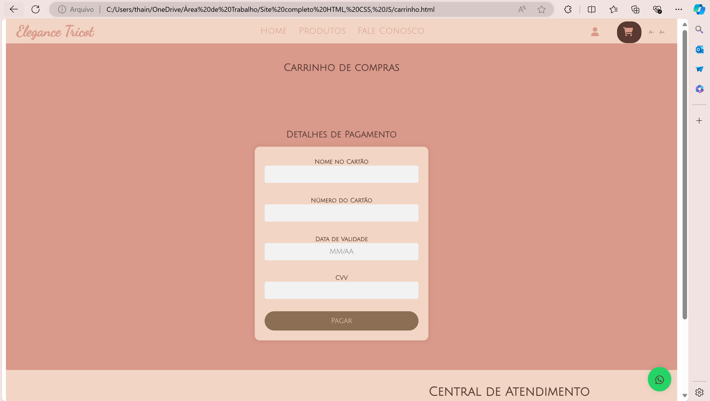
  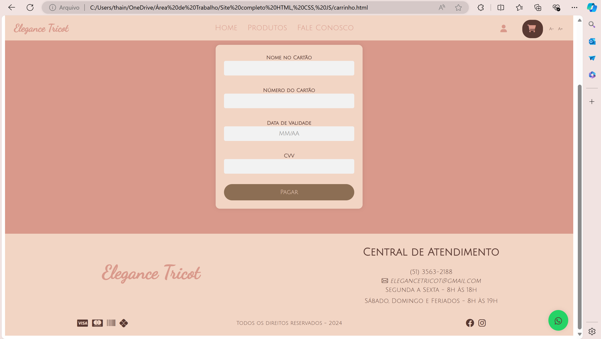
   

